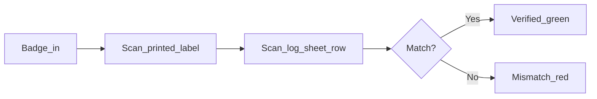

# Label Verification System — 30-Minute Presentation Deck

**Audience:** Production, quality, and operations leaders (non-technical)  
**Presenter:** Alltech engineering intern  
**Runtime:** ~30 minutes (22 slides + ~5 min live demo + ~3 min Q&A)

---

## Timing guide

| Section | Slides | Minutes | Cumulative |
|---------|--------|---------|------------|
| A — Setting the stage (AI tools + intro) | 1–4 | 6 | 6 |
| B — The problem | 5–8 | 7 | 13 |
| C — The solution | 9–15 | 12 | 25 |
| **Live demo** | — | 5 | 30 |
| D — What's real vs next | 16–19 | *(flex; trim if demo runs long)* | — |
| E — Close | 20 | 2 | — |

**Tip:** If running long, shorten slides 16–18 to one combined slide and move detailed roadmap to backup.

---

## Opening script (~30 seconds)

> "Good morning. I'm [name], engineering intern at Alltech. Over the past few weeks I built a working prototype — with help from AI tools — that gives our label room a digital double-check on top of the paper FMI B001 log. The paper binder stays. This app catches mismatches before labels hit the line and gives supervisors a record of who verified what. I'll show you how it works live in a few minutes."

---

## Slide 1 — Title

**Title:** Label Verification System  
**Subtitle:** Digital double-check for FMI B001 Label Log Out  
**Footer:** Alltech · [Date] · [Your name]

**Bullets:**
- Companion to the paper process — not a replacement
- Built as a floor-ready prototype

**Visual:** Alltech logo + dark industrial background (match app UI)

**Speaker notes:** Set expectation: this is a briefing from the label room, not a software lecture. You built something operators can use today on one PC.

---

## Slide 2 — What is Claude?

**Title:** What is Claude?

**Bullets:**
- **Claude** = conversational AI (like a very knowledgeable assistant)
- You describe a problem in plain English; it helps draft solutions, explain tradeoffs, and refine ideas
- It does not run the label room — **you** decide what to build and test on real hardware

**Visual:** Simple icon: person → speech bubble → document/checklist

**Speaker notes:** Avoid "large language model." Say: "I ask questions and describe workflows; Claude helps me turn that into a plan, screen layouts, and fixes when something doesn't work with the scanner."

---

## Slide 3 — What is Cursor?

**Title:** What is Cursor? (Where the app was built)

**Bullets:**
- **Cursor** = a code editor with AI built in (think: Word for documents, but for building apps)
- **Claude inside Cursor** helped write and adjust the app while I described label-room needs
- **My role:** define the workflow, test with Zebra scanner and badge reader, fix what operators would find confusing

**Visual:** Diagram — You (operator workflow expert) + Cursor/Claude (draft & fix) → Working app in browser

**Speaker notes:** Emphasize: AI accelerated a prototype that might have taken much longer traditionally. Supervisors still own whether the process is correct.

---

## Slide 4 — Why build it this way?

**Title:** Why AI-assisted development for a floor tool?

**Bullets:**
- Fast iteration — change the screen after one shift of feedback
- Built around **real hardware** (scanner + badge reader plug in like keyboards)
- Demo-able in weeks, not months
- Easy to throw away or rewrite parts without a big IT project

**Visual:** Timeline: Idea → Prototype on label-room PC → Feedback → Next version

**Speaker notes:** Bridge to the app: "What we built is a scanning station that double-checks every printed label against the log sheet before it leaves the print room."

---

## Slide 5 — What happens today

**Title:** The process today — paper FMI B001

**Bullets:**
- Operators **log labels out** on the FMI B001 form (paper binder)
- Batch numbers, products, quantities recorded by hand
- Official compliance record stays on paper

**Visual:** Photo or illustration of FMI B001 log sheet (blur sensitive data)

**Speaker notes:** Respect the existing process. Paper is the official record; we're not asking to remove it.

---

## Slide 6 — What can go wrong

**Title:** What can go wrong without a machine check?

**Bullets:**
- Wrong **batch** on the wrong roll (parent vs split, e.g. BO122232 vs BO122232-02)
- **Label code** on the roll doesn't match the row on the log sheet
- No **timestamped digital record** of who verified what
- Hard for supervisors to **audit** after the fact

**Visual:** Two labels side-by-side with subtle difference highlighted (batch or code)

**Speaker notes:** These are human-process risks, not accusations. The goal is prevention at scan time.

---

## Slide 7 — Why paper alone isn't enough

**Title:** Paper stays — but the floor needs immediate feedback

**Bullets:**
- Paper = **official binder** (unchanged)
- Floor needs **now**: green = good to go, red = stop, impossible to miss
- Mismatch must show **exactly** what differed (batch vs label code)

**Visual:** Split: left = binder on shelf; right = big green/red screen on scanner station

**Speaker notes:** The app is the loud second set of eyes at the moment of check-out.

---

## Slide 8 — What success looks like

**Title:** What success looks like

**Bullets:**
- Every batch **verified by a named operator** (badge sign-in)
- **Both** physical artifacts scanned — printed label **and** log sheet row
- Mismatch **caught before** labels reach the line
- Supervisors get an **exportable record** (CSV / print summary)

**Visual:** Checklist with green checkmarks

**Speaker notes:** Transition: "Here's how the prototype does that."

---

## Slide 9 — Core idea: two-scan handshake

**Title:** Two scans, one verdict

**Bullets:**
- **Scan 1:** Printed label (batch barcode + label code QR)
- **Scan 2:** Log sheet row for that batch
- **Match rule:** Batch number **and** label code must agree on both sides
- Nothing auto-filled from a database — both sides come from **physical scans**

**Visual:** Flow diagram

**Speaker notes:** This is the heart of the app. Strict on purpose — no shortcuts.

---

## Slide 10 — Operator flow (step by step)

**Title:** What the operator does

**Bullets:**
1. **Badge in** — tap door badge on reader
2. **Card 1 (Printed Label)** — scan batch, then label code
3. **Card 2 (Log Sheet)** — unlocks; scan matching row
4. **Green** = verified, next batch · **Red** = mismatch, re-scan or flag

**Visual:** `[SCREENSHOT: Scan zone — Card 1 active, Card 2 dimmed]`

**Speaker notes:** UI is sequential on purpose — Card 2 is greyed out until Card 1 is done so new operators don't scan in the wrong order.

---

## Slide 11 — Accountability

**Title:** Who verified what?

**Bullets:**
- **RFID badge** signs operator in (e.g. badge 13925)
- Same badge again = sign out
- **Activity log** records every scan, verify, mismatch, sign-in
- Re-checking an already-verified batch requires explicit confirmation (logged)

**Visual:** Header bar showing operator name + session ID

**Speaker notes:** Badge is accountability, not security against a determined attacker — it's floor-level traceability.

---

## Slide 12 — What the operator sees

**Title:** The screen — four zones

**Bullets:**
- **Header** — Alltech logo, session, shift, operator name
- **Scan zone** — "Scan two barcodes to verify a label" + two cards
- **Batch log** — "21 of 65 labels checked today" + progress ring
- **Data upload** — Import today's D365 print run (CSV) + optional sheet photo

**Visual:** `[SCREENSHOT: Full main screen annotated with four zones]`

**Speaker notes:** Dark theme on purpose — label room lighting, high contrast amber/green.

---

## Slide 13 — Mismatch vs verified

**Title:** Green means go. Red means stop.

**Bullets:**
- **Verified:** Full-width green banner — batch number, auto-advance to next
- **Mismatch:** Full-screen red — side-by-side what label had vs what sheet had
- Operator can **re-scan** or **flag for supervisor**

**Visual:** `[SCREENSHOT: Green verified]` and `[SCREENSHOT: Red mismatch]` (two images or before/after)

**Speaker notes:** Red screen is intentionally alarming — same philosophy as andon.

---

## Slide 14 — Supervisor tools (today)

**Title:** Audit trail — no server required

**Bullets:**
- **Activity log** — every event in the app
- **Export CSV** — Operator, Child Batch, Parent Batch, Item, Qty, Result, Timestamp
- **Print summary** — one-click printable report with date, shift, totals
- Opens in Excel today — zero IT infrastructure

**Visual:** `[SCREENSHOT: Activity drawer with Export CSV / Print summary]`

**Speaker notes:** Filename includes date and session ID. Good enough for pilot; Phase 2 puts this in a central database.

---

## Slide 15 — Live demo

**Title:** Live demo

**Bullets:**
- Double-click **Start Label Verification.bat**
- Badge in → scan label → scan sheet → green
- Show batch log updating
- Optional: trigger a mismatch to show red screen

**Visual:** `[LIVE — or 4-panel screenshot storyboard if no network]`

**Speaker notes:** Rehearse this block the night before. Have a known good batch on FMLB003 loaded. ~5 minutes max.

---

## Slide 16 — What works today

**Title:** Prototype — what is real now

**Bullets:**
- Runs on **one label-room PC** (browser, local storage)
- **Per-sheet memory** — FMLB003 and FMI B001 keep separate check-out status
- **D365 CSV import** with adjustable column mapping
- Sheet photo upload, multi-step reset to wipe test data safely
- Works with **Zebra scanner + prox badge reader** (USB keyboard mode)

**Visual:** PC + scanner + badge reader photo

**Speaker notes:** Honest: "prototype on one station," not company-wide rollout yet.

---

## Slide 17 — What is NOT production yet

**Title:** Honest limits today

**Bullets:**
- **No central database** — memory lives in that browser on that PC
- **No sync** across multiple stations
- **No live D365** feed — CSV upload instead
- **No OCR** — app doesn't read uploaded sheet photos automatically yet
- **No sheet-row QR** printed from BarTender yet (future)

**Visual:** "Today" vs "Not yet" two-column list

**Speaker notes:** Preempt IT questions. Architecture is designed to swap local storage for Azure later.

---

## Slide 18 — Roadmap

**Title:** Three phases

**Bullets:**
- **Phase 1 (now):** Floor prototype, local audit, CSV export, operator feedback
- **Phase 2:** Azure database, multi-station sync, D365 integration, IT ownership
- **Phase 3:** BarTender prints QR on each FMI B001 row at print time — sheet scan becomes one scan

**Visual:** Stair-step roadmap graphic

**Speaker notes:** Phase 3 removes the "simulate sheet scan" workaround used in demo today.

---

## Slide 19 — Discussion

**Title:** Questions for you

**Bullets:**
- What would supervisors need to **trust** this on the floor?
- Which sheet / product lines should pilot first?
- What would **IT** need for Phase 2 (hosting, Entra ID, D365 access)?

**Visual:** Question marks or open floor icon

**Speaker notes:** Pause here if demo ran long; skip if short on time.

---

## Slide 20 — Summary

**Title:** Summary

**Bullets:**
- **Paper FMI B001 stays** — app supplements with machine double-check
- **Two-scan handshake** — label + sheet, both must match
- **Built fast** with Cursor + Claude; tested on real scanners
- **Ready for feedback and pilot** on the label-room PC

**Visual:** Alltech logo + app tagline

**Speaker notes:** Thank the room. Offer to leave CSV export sample and demo link on the PC.

---

## Closing script (~30 seconds)

> "To wrap up: we're not replacing the paper log. We're adding a second check at the scanner — green or red, loud and clear — with a name and timestamp on every verification. This prototype is on the label-room PC today. I'd love your feedback on whether we'd trust it for a pilot, and what IT would need for the next phase. Thank you."

---

## Anticipated Q&A

**Q: What if the PC reboots?**  
A: Check-out memory is stored in the browser on that PC. After reboot, run the Start batch file again. Verified batches from earlier in the day should still be there unless someone cleared browser data. Supervisors should export CSV at end of shift as backup.

**Q: Does this replace the paper FMI B001?**  
A: No. Paper remains the official log. The app is a digital double-check and audit trail at check-out time.

**Q: Can two operators use it at once?**  
A: One operator signed in at a time per browser session. Multiple PCs would each have their own memory until Phase 2 central database.

**Q: What if someone scans the wrong barcode (UPC instead of batch)?**  
A: The app detects product-only codes and tells the operator to scan the batch barcode at the bottom of the label instead.

**Q: How was this built so fast?**  
A: Cursor + Claude for drafting and iteration; constant testing on real Zebra scanner and badge reader; focused scope — one workflow, done well.

**Q: Is it secure / FDA / audit ready?**  
A: Not validated for regulatory submission as-is. It provides timestamped operator-attributed records suitable for internal quality audit. Phase 2 would involve IT, validation, and central storage policies.

---

## Rehearsal checklist

- [ ] Load app via `Start Label Verification.bat`; confirm badge 13925 (or your badge) enrolled
- [ ] FMLB003 sheet loaded with batches visible in log
- [ ] Practice demo path: badge → label batch → label QR → sheet batch → sheet QR → green
- [ ] Optional: prepare one intentional mismatch
- [ ] Export CSV once so you can show filename format
- [ ] Time full run: aim for **25 min slides + 5 min demo**; cut slides 17–18 if over
- [ ] Bring backup: PDF of this deck + 4 screenshots on USB if live demo fails

---

## Screenshot capture list

Capture these from the running app before building slides in PowerPoint/Google Slides:

1. Badge gate — full screen "Scan your badge to start"
2. Scan zone — Card 1 active (amber), Card 2 locked (dim)
3. Green VERIFIED banner after successful match
4. Batch log header — "N of M labels checked today"
5. Red mismatch overlay (optional but high impact)
6. Activity drawer — Export CSV and Print summary buttons
